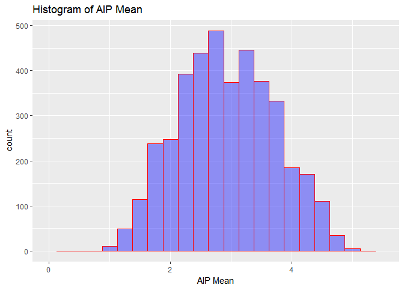
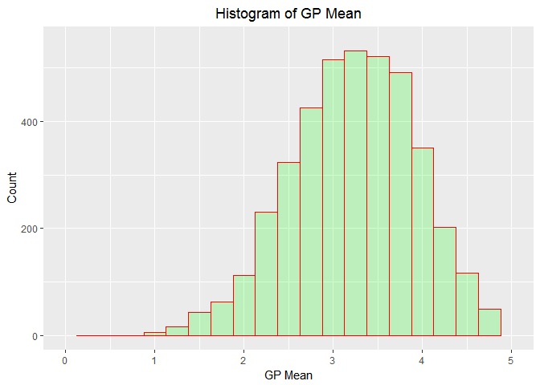

# PROCRASTINATION - A global analysis
Kevin Mendonsa & Ruhaab Markas  
November 26, 2017  


## Introduction

You have finally finished data collection; it involved various measures of procrastination and the qualities these folks have. You plan on pitching a proposal to a company of your choosing. The details of the company, the objectives of the repo, and some of the questions are up to you; however, you should make sure that you answer at minimum the questions posed in the Tasks section. Though you get some leeway as data scientists, there are some baseline questions that the company wants to know about the data they funded. This is the resulting data set from the study, tabulated by Qualtrics. It is not entirely well-cleaned and will need some manipulation to make it useful.


#### R - Environment


```r
sessionInfo()
```

```
## R version 3.4.2 Patched (2017-09-30 r73418)
## Platform: x86_64-w64-mingw32/x64 (64-bit)
## Running under: Windows 7 x64 (build 7601) Service Pack 1
## 
## Matrix products: default
## 
## locale:
## [1] LC_COLLATE=English_United States.1252 
## [2] LC_CTYPE=English_United States.1252   
## [3] LC_MONETARY=English_United States.1252
## [4] LC_NUMERIC=C                          
## [5] LC_TIME=English_United States.1252    
## 
## attached base packages:
## [1] stats     graphics  grDevices utils     datasets  methods   base     
## 
## loaded via a namespace (and not attached):
##  [1] compiler_3.4.2  backports_1.1.0 magrittr_1.5    rprojroot_1.2  
##  [5] tools_3.4.2     htmltools_0.3.6 yaml_2.1.14     Rcpp_0.12.12   
##  [9] stringi_1.1.5   rmarkdown_1.6   knitr_1.17      stringr_1.2.0  
## [13] digest_0.6.12   evaluate_0.10.1
```

### Libraries required


```
## Loading required package: gsubfn
```

```
## Loading required package: proto
```

```
## Loading required package: RSQLite
```

```
## 
## Attaching package: 'dplyr'
```

```
## The following objects are masked from 'package:stats':
## 
##     filter, lag
```

```
## The following objects are masked from 'package:base':
## 
##     intersect, setdiff, setequal, union
```

```
## Loading required package: xml2
```

```
## -------------------------------------------------------------------------
```

```
## You have loaded plyr after dplyr - this is likely to cause problems.
## If you need functions from both plyr and dplyr, please load plyr first, then dplyr:
## library(plyr); library(dplyr)
```

```
## -------------------------------------------------------------------------
```

```
## 
## Attaching package: 'plyr'
```

```
## The following objects are masked from 'package:dplyr':
## 
##     arrange, count, desc, failwith, id, mutate, rename, summarise,
##     summarize
```

```
## Loading tidyverse: ggplot2
## Loading tidyverse: tibble
## Loading tidyverse: readr
## Loading tidyverse: purrr
```

```
## Conflicts with tidy packages ----------------------------------------------
```

```
## arrange():   dplyr, plyr
## compact():   purrr, plyr
## count():     dplyr, plyr
## failwith():  dplyr, plyr
## filter():    dplyr, stats
## id():        dplyr, plyr
## lag():       dplyr, stats
## mutate():    dplyr, plyr
## rename():    dplyr, plyr
## summarise(): dplyr, plyr
## summarize(): dplyr, plyr
```

```
## 
## Attaching package: 'formattable'
```

```
## The following object is masked from 'package:xtable':
## 
##     digits
```

# Set the working directory for the Data


```r
# Set the working directory for the Data
  BaseDir <- "C:\\Users\\kevinm\\Documents\\GitHub\\CaseStudy2\\source\\"

# set working directory
  setwd(BaseDir)
```

## Load the data from the csv files and from the web


```r
procrastinate_raw <- read.csv("Procrastination.csv", 
                                  na.strings = "NA", 
                                  blank.lines.skip = TRUE,
                                  sep = ",",
                                  strip.white = TRUE)


# Assign the url to scrape the data from
  HDI_url <- "https://en.wikipedia.org/wiki/List_of_countries_by_Human_Development_Index"

#  HDI_url <- "https://en.wikipedia.org/wiki/List_of_countries_by_Human_Development_Index#Complete_list_of_countries"
  
# Assign the xpaths for the various tables to be scraped from the url
  VHigh_HDI_xpath <- '//*[@id="mw-content-text"]/div/div[5]/table'
   High_HDI_xpath <- '//*[@id="mw-content-text"]/div/div[6]/table'
   Med_HDI_xpath  <- '//*[@id="mw-content-text"]/div/div[7]/table'
   Low_HDI_xpath  <- '//*[@id="mw-content-text"]/div/div[8]/table'

# Scrape the tables from the site and create a data frame for each
  VHigh_HDI_text <- HDI_url %>%
    read_html() %>%
    html_nodes(xpath=VHigh_HDI_xpath) %>% 
    html_table(fill = T) 
  
  High_HDI_text <- HDI_url %>%
    read_html() %>%
    html_nodes(xpath=High_HDI_xpath) %>% 
    html_table(fill = T) 
  
  Med_HDI_text <- HDI_url %>%
    read_html() %>%
    html_nodes(xpath=Med_HDI_xpath) %>% 
    html_table(fill = T) 
  
  Low_HDI_text <- HDI_url %>%
    read_html() %>%
    html_nodes(xpath=Low_HDI_xpath) %>% 
    html_table(fill = T) 

# Create data frames for the scraped data  
  VHigh_HDI_df <- data.frame(VHigh_HDI_text[[1]])
   High_HDI_df <- data.frame( High_HDI_text[[1]])
    Med_HDI_df <- data.frame(  Med_HDI_text[[1]])
    Low_HDI_df <- data.frame(  Low_HDI_text[[1]])

      
# Add the Category for each data frame                               
        VHigh_HDI_df <- sqldf("select 'Very High' as HDICategory,
                               X3 as Country,
                               X4 as HDI
                               from VHigh_HDI_df
                               Where VHigh_HDI_df.X3 not in ('Rank', 'Country',
                               'Change in rank from previous year[1]')")
        
        High_HDI_df <- sqldf("select 'Very High' as HDICategory,
                              X3 as Country,
                              X4 as HDI
                              from High_HDI_df
                              Where High_HDI_df.X3 not in ('Rank', 'Country',
                              'Change in rank from previous year[1]')")
        
        Med_HDI_df <- sqldf("select 'Very High' as HDICategory,
                              X3 as Country,
                              X4 as HDI
                              from Med_HDI_df
                              Where Med_HDI_df.X3 not in ('Rank', 'Country',
                              'Change in rank from previous year[1]')")
        
        Low_HDI_df <- sqldf("select 'Very High' as HDICategory,
                             X3 as Country,
                             X4 as HDI
                             from Low_HDI_df
                             Where Low_HDI_df.X3 not in ('Rank', 'Country',
                             'Change in rank from previous year[1]')")
        
# Merge all the data frames into a single data frame HDI_raw
        HDI_raw <- rbind(VHigh_HDI_df,
                          High_HDI_df,
                           Med_HDI_df,
                           Low_HDI_df )
```
  
# The datasets we used to analyze global procrastination consisted of 
  the following observations and variables:
  Procrastination data: 
  Human Development Index data
  

```r
 # dim(procrastinate_raw)
   cbind(ROWS=NROW(procrastinate_raw), COLUMNS=NCOL(procrastinate_raw))
```

```
##      ROWS COLUMNS
## [1,] 4264      61
```

```r
 # dim(HDI_raw)
```

  
# Prepare data for cleansing and transformation 


```r
# Add a uniqueID to each row - we may need it later
  procrastinate_raw <- rowid_to_column(procrastinate_raw, "RowID")

# Create a new data frame from raw data for cleansing but retain the original dataset for reference
  procrastinate <- procrastinate_raw
  webscrape     <- HDI_raw
```
  

# Rename the variables


```r
names(procrastinate) <- c("RowID",
                            "Age",
                            "Gender",
                            "Kids",
                            "Education",
                            "WrkStatus",
                            "Income",
                            "Occupation",
                            "YearsInPos",
                            "MnthsInPos",
                            "CommSize",
                            "Country",
                            "MaritalStat",
                            "Sons",
                            "Daughters",
                            "DP1",
                            "DP2",
                            "DP3",
                            "DP4",
                            "DP5",
                            "AIP1",
                            "AIP2",
                            "AIP3",
                            "AIP4",
                            "AIP5",
                            "AIP6",
                            "AIP7",
                            "AIP8",
                            "AIP9",
                            "AIP10",
                            "AIP11",
                            "AIP12",
                            "AIP13",
                            "AIP14",
                            "AIP15",
                            "GP1",
                            "GP2",
                            "GP3",
                            "GP4",
                            "GP5",
                            "GP6",
                            "GP7",
                            "GP8",
                            "GP9",
                            "GP10",
                            "GP11",
                            "GP12",
                            "GP13",
                            "GP14",
                            "GP15",
                            "GP16",
                            "GP17",
                            "GP18",
                            "GP19",
                            "GP20",
                            "SWLS1",
                            "SWLS2",
                            "SWLS3",
                            "SWLS4",
                            "SWLS5",
                            "SelfProcrast",
                            "OthrProcrast")
```
  
# Convert character fields to a character datatype from factor


```r
  procrastinate$Gender        <- as.character(procrastinate$Gender)
  procrastinate$Kids          <- as.character(procrastinate$Kids)
  procrastinate$Education     <- as.character(procrastinate$Education)
  procrastinate$WrkStatus     <- as.character(procrastinate$WrkStatus)
  procrastinate$Occupation    <- as.character(procrastinate$Occupation)
  procrastinate$CommSize      <- as.character(procrastinate$CommSize)
  procrastinate$Country       <- as.character(procrastinate$Country)
  procrastinate$MaritalStat   <- as.character(procrastinate$MaritalStat)
  procrastinate$SelfProcrast  <- as.character(procrastinate$SelfProcrast)
  procrastinate$OthrProcrast  <- as.character(procrastinate$OthrProcrast)  
```
  
  
# Add new columns for the mean of each survey mean by individual - DPMean, AIPMean, GPMean, SWLSMean


```r
  procrastinate <-  transform(procrastinate,  DPMean = rowMeans(procrastinate[,15:19], na.rm = TRUE)) %>% 
                                  transform( AIPMean = rowMeans(procrastinate[,20:34], na.rm = TRUE)) %>%
                                  transform(  GPMean = rowMeans(procrastinate[,35:54], na.rm = TRUE)) %>%
                                  transform(SWLSMean = rowMeans(procrastinate[,55:59], na.rm = TRUE)) 
  
# Round all means to 2 digits to  
  procrastinate$DPMean   <- round(procrastinate$DPMean,   digits =2)
  procrastinate$AIPMean  <- round(procrastinate$AIPMean,  digits =2)
  procrastinate$GPMean   <- round(procrastinate$GPMean,   digits =2)
  procrastinate$SWLSMean <- round(procrastinate$SWLSMean, digits =2)
```
  
                       
# Remove whitepsace by trimming the right and left sides


```r
# Trim whitespace on left and right of value  
  procrastinate$Occupation <- str_trim(procrastinate$Occupation) 
  
# Clean up "Occupations"
# Replace all "blank" values with an explicit "*Missing*"
  procrastinate$OccupatnAlt <-gsub("^$","*Missing*",procrastinate$Occupation)
  
# Normalize the data and make it easier to group/categorize if necessary  
  procrastinate$OccupatnAlt <- plyr::revalue(procrastinate$OccupatnAlt ,
c("0" = "*Missing*", 
  "abc"="*Missing*",
  "Academic Assistant"="Academic - Administration",
  "Academic"="Teacher",
  "academic/career coach & admin assistant"="Counselor - career Coach",
  "Account Manager"="Sales - Account Manager",
  "account planner"="Sales - Account Planner",
  "Account Service Rep"="Sales - Account Rep",
  "Accounting Assistant"="Accountant",
  "Accounting Manager"="Accountant",
  "Accounting"="Accountant",
  "Accounts Payable / Fleet Manager"="Accountant",
  "Accounts Payable"="Accountant",
  "acounting analyst"="Accountant",
  "Activities Leader"="*Ambiguous*",
  "adjunct faculty / University + communit"="Professor",
  "admin assist"="Adminstrative Assistant",
  "Administration Assistant"="Adminstrative Assistant",
  "Administrative Asistant for Jewelry Stor"="Admin Assistant",
  "Administrative Officer"="Administrator",
  "advocate"="Attorney",
  "airline"="*Missing*",
  "airport ground handler"="airport ground handler",
  "Artist/ designer/builder"="Artist",
  "Artist/administrator"="Artist",
  "artist/designer/homemaker"="Artist",
  "Assistant District Attorney"="Attorney",
  "assistant general counsel"="Attorney",
  "assistant professor"="Professor",
  "Assistant"="Administrative Assistant",
  "Assoc. Governmental Program Analyst"="Program Analyst",
  "Associate / investment banking"="Banking - Investment associate",
  "associate at law firm"="Attorney",
  "Associate Director"="Film/TV - Associate Director",
  "Associate director/ marketing communicat"="Marketing - Communications",
  "Associate Producer"="Film/TV - Associate Producer",
  "asst"="Assistant",
  "Asst. Pre-school Teacher"="Teacher",
  "Asst. Prof."="Professor",
  "Attorney-self employed"="Attorney",
  "audio engineer"="Engineer - Audio",
  "Bank Teller"="Banking - teller",
  "banker"="Banking",
  "Bar & Restaurant Owner"="Restaurant & Bar Owner",
  "bookkeeper/ actor"="Bookkeeper",
  "Business / Test Analyst"="IT - Systems Analyst",
  "BUSINESS CONSULTA"="Business consultant",
  "business manager"="Manager",
  "Business Owner"="Business Owner / Self Employed",
  "Business Systems Analyst"="IT - Systems Analyst",
  "business"="Business Owner / Self Employed",
  "businesswoman"="Business Owner / Self Employed",
  "C E O/ M D"="CEO",
  "Campus Planner"="Planner - Campus",
  "Capstone Golf Course"="*Ambiguous*",
  "Career Placement Associate"="Counselor - career Placement",
  "Casting Director"="Film - casting Director",
  "catholic priest/ full timestudent"="Priest",
  "Certified Nurse's Assistant"="Nursing - Certified Assistant",
  "chairman of the board"="Chairman",
  "chauffeur"="Driver",
  "Chief Financial Officer"="CFO",
  "Chiefe Development Engineer"="Engineer - Development",
  "Client Relationship Assistant"="Sales - Client Relationship Assistant",
  "Clinical Dietitian"="Dietitian - Clinical",
  "Collection management specialist"="Collections",
  "College Administrator"="Academic - Administration",
  "college faculty"="Professor",
  "college professor"="Professor",
  "Communications & Publishing"="Communications & Publishing",
  "company director"="Director",
  "Computer Consultant"="IT - Consultant",
  "Computer Instructor (Continuing Educatio"="Teacher",
  "Computer Operator"="IT - Systems Analyst",
  "Computer Programmer"="IT - Software Engineer",
  "Computer Science"="IT - Systems Analyst",
  "Computer Systems Analyst"="IT - Systems Analyst",
  "Computers"="IT Systems Analyst",
  "Consultant and entrepreneur (small busin"="Business Owner / Self Employed",
  "Consumer Case Coordinator"="Case Coordinator - Consumer",
  "Controller"="Financial Controller",
  "Contsuruction Management"="Construction Management",
  "Coordinator of International Programs"="Program Coordinator",
  "coordinatore operativo"="Operations - Coordinator",
  "Co-Proprietor"="Business Owner / Self Employed",
  "Corporate instructor"="Corporate Trainer",
  "Corporation President"="President",
  "Corrections"="Corrections Officer",
  "Country Style Employee"="*Ambiguous*",
  "CRNA"="Nursing - Certified Registered Anesthetist",
  "Customer Service at Domino's Pizza"="Customer Service",
  "Data Warehouse Engineer"="IT - DW Engineer",
  "Dealer"="*Ambiguous*",
  "Dental & Disability Coordinator"="Dental & Disability Coordinator",
  "Dept. Director (Non-profit)"="Non Profit - Director",
  "Deputy Chief of Public Information for t"="Public Information - Deputy Chief",
  "Deputy Chieif Information Officer"="IT - CIO (Deputy)",
  "deputy practice manager"="*Ambiguous*",
  "detail checker"="*Ambiguous*",
  "Developer"="IT Software engineer",
  "Diplomat"="Foreign Affairs",
  "Director / information technology"="IT - Director",
  "Director of a language program"="Language - Program Director",
  "Director of Academic Affairs"="Academic - Administration (Director)",
  "Director of business development"="Business Development - Director",
  "Director of Contract Management"="Contract Management - Director",
  "Director of non-profit organization"="Non Profit - Director",
  "Director of Software Company"="Director",
  "Director Operations"="Operations - Director",
  "Disability Allowance"="*Ambiguous*",
  "Dish Washer"="Dishwasher",
  "Divisional Manager of a large cosmetics"="Director",
  "Doctor Research"="Physician - Research",
  "Doctor; Physician"="Physician",
  "Early child hood teacher"="Teacher",
  "Early Childhood Education Student/ Nanny"="Student",
  "Economy"="Economist",
  "Editor Attorney"="Attorney",
  "Education (at a university)"="Professor",
  "education administration"="Academic - Administration",
  "Education Specialist"="Academic - Administration",
  "education"="Teacher",
  "Educator/Student"="Teacher",
  "EFL Teacher/ Professional Researcher"="Teacher",
  "EHS Manager"="Environmental - EHS Manager",
  "Electrical Technician"="Electrician",
  "employed by a church"="*Ambiguous*",
  "energy therapist"="Therapist - Energy",
  "Entrepreneur & Consultant"="Business Owner / Self Employed",
  "entrepreneur"="Business Owner / Self Employed",
  "environmental education non profit direc"="Environmental - Education/Non Profit",
  "Environmental Senior Specialist"="Environmental Specialist",
  "EOD"="Military - Explosive Ordinance Disposal",
  "Epidemiologist"="Physician - Epidemiologist",
  "ESL Teacher/Biologist"="Teacher",
  "Executive Vice President / Senior Lender"="Vice President",
  "fdsdf"="*Missing*",
  "federal excise tax auditor"="Tax Auditor",
  "film editor"="Film - Editor",
  "Film Industry/Miscelanious"="Film - Other",
  "Film maker"="Film - Maker",
  "financial officer / small career-trainin"="financial officer",
  "First VP & Associate General Counsel"="Attorney",
  "Fitness Assistant / wellness mentor / ca"="Fitness Instructor - Wellness mentor",
  "Framer/Sales Associate"="Framer",
  "free lance bookkeeper"="Bookkeeper",
  "Free lance editor and tutor--in theory"="Editor - Freelance",
  "free professionist"="Business Owner / Self Employed",
  "Freelance ESL Teacher"="Teacher",
  "Freelance musician / part time EMT / pri"="Musician",
  "Freelance Project Manager"="Project Manager",
  "Freelance"="Business Owner / Self Employed",
  "full time student and part time bartende"="Student",
  "Full-Time Mother / Part-Time Editor"="home maker",
  "fulltime office assistant"="Office Assistant",
  "Gender/Public Health Consultant"="Public Health - Consultant",
  "Gove service"="Civil servant",
  "Graduate Research Assistant"="Graduate Assistant - Research",
  "Graduate Researcher"="Researcher - Graduate",
  "Graduate student/University instructor"="Student",
  "Graduate student--research and teaching"="Student",
  "Grease Monkey"="*Ambiguous*",
  "Grocery Store Salesman"="Grocery Store Salesman",
  "Head - Operations & QA"="Operations & QA",
  "health care"="Healthcare",
  "Healthcare Consultant"="Healthcare - Consultant",
  "host"="Restaurant - Host/Hostess",
  "hostess"="Restaurant - Host/Hostess",
  "Hotel Desk Clerk"="Hospitality - Desk Clerk",
  "Housekeeping"="Hospitality - Housekeeping",
  "houswife"="home maker",
  "Human Resource Manager"="HR Manager",
  "Human Resource Manger"="HR Manager",
  "information assisstant"="IT - Assistant",
  "Information Developer"="IT - Software engineer",
  "Information Management"="IT - Manager",
  "Information Technology Consultant"="IT - Consultant",
  "Information technology"="IT",
  "In-house Legal Counsel"="Attorney",
  "innkeeper"="Hospitality - innkeeper",
  "Instructional Assistant Online"="Instructor - Online Assistant",
  "instructor / coach"="Instructor - Coach",
  "intern"="*Ambiguous*",
  "Internet & media consultant"="Media & Internet - Consultant",
  "Internship"="*Ambiguous*",
  "interpreter"="Translator / Interpreter",
  "Investment Assistant"="Banking - Investment Assistant",
  "investment banker"="Banking - Investment banker",
  "Investment Counsel"="Banking - Investment Counselor",
  "ISTraining Coordinator"="IT - Training Coordinator",
  "IT admin"="IT Administrator",
  "IT Support"="IT - Support Engineer",
  "IT systems administrator"="IT - Systems Analyst",
  "IT Technician"="IT - Support Engineer",
  "jewelry artist"="Artist - jewelry",
  "journalist (freelance)"="Journalist",
  "Juvenile Corrections Officer"="Corrections Officer - Juvenile",
  "Lab Director/Archeologist"="Lab Director",
  "Lab Services Assistant"="Lab  Assistant",
  "laboratory technician"="Lab Technician",
  "laborer (construction)"="Construction",
  "land use planner"="Planner - land use",
  "Law clerk"="Legal Clerk",
  "lecturer"="Professor",
  "Legal Assistant / Office Manager"="Legal Assistant / Office Manager",
  "Library Assistant"="Librarian Assistant",
  "library paraprofessional"="Librarian",
  "Library technician"="Librarian",
  "Lift Ops"="Lift Operator",
  "LPN"="Nursing - Licensed Practical",
  "maintenance tech."="Maintenance technican",
  "Management Consultant & Entrepreneur"="Management consultant",
  "Manager - Analytical and Environmental S"="Environmental - Analytical Manager",
  "manager IT"="IT - Manager",
  "Market Analyst"="Marketing Research Analyst",
  "Market Research Analyst"="Marketing Research Analyst",
  "Marketing"="Marketing",
  "md"="*Ambiguous*",
  "Mechanical Engineer"="Engineer - mechanical",
  "mktg"="Marketing",
  "musician/student/teacher"="Musician",
  "na"="*Missing*",
  "Nanny and student"="Nanny",
  "Network Engineer"="IT Network Engineer",
  "Network Services Engineer"="IT Network Engineer",
  "new realtor"="Realtor",
  "newspaper carrier"="Newspaper delivery",
  "Non-profit Consultant"="Non-profit Consultant",
  "Office Manager / Accountant"="Office Manager",
  "Office Services Manager"="Office Manager",
  "office"="Office Admin",
  "Online Media Buyer"="Buyer - Online Media",
  "Organic Grocery Store Cashier/shift lead"="Cashier",
  "Ornithology Graduate Student and Teachin"="Student",
  "ouh"="*Missing*",
  "owner - private practice physical therap"="Physical Therapist",
  "Owner"="Business Owner / Self Employed",
  "Page Designer for a newspaper"="Graphic Designer",
  "Paraprofessional"="*Ambiguous*",
  "Parent Educator/Supervisor"="home maker",
  "Partner"="*Ambiguous*",
  "PCA for a quadrapilegic and a PCA for a"="PCA - Quadriplegic",
  "Pharmaceutical Merchandiser"="Merchandiser - Pharmaceutical",
  "pharmacy tech."="Pharmacist",
  "phd student researcher"="Student",
  "photo profucer"="Photographer",
  "physician (internist)"="Physician - Intern",
  "Physiotherapst"="Physiotherapst",
  "pjublic relations director"="Public Relations",
  "Please specify title Manager for Regulat"="*Missing*",
  "please specify" = "*Missing*",
  "Post Grad Physician"="Physician - Post Grad",
  "Postdoc"="Student - Post Doctoral",
  "Postdoctoral Researcher"="Researcher - Post Doctoral",
  "pr and communications firm owner"="Public Relations",
  "President Nongovernmental organization"="President - NGO",
  "president/CEO"="CEO",
  "Probation Supervisor"="Probation officer",
  "Process Engineer"="Engineer - Process",
  "Procrastinator"="*Missing*",
  "Produce Associate"="Grocery Store - produce associate",
  "producer"="Film - Producer",
  "Production Operations Support Analyst"="Operations - Production Support Analyst",
  "Professional Organizer"="Organizer - professional",
  "Professional Soccer Player"="Soccer Player - Professional",
  "Programmer Analyst"="IT Software engineer",
  "Programmer"="IT Software engineer",
  "Programmer/Developer"="IT Software engineer",
  "Programmer/Software Analyst"="IT Software engineer",
  "Proposal Director"="Contract/Proposal - Director",
  "psychologis"="Psychologist",
  "P-T College Faculty & P-T Self-Employed"="Professor",
  "real estate broker"="Realtor",
  "Real estate developer"="Real Estate Developer",
  "real estate"="Real estate agent",
  "realtor"="real estate agent",
  "Reasearch assistant"="Research Assistant",
  "Receptionist"="Receptionist",
  "Recreational Staff"="Recreational Staff",
  "Regional Sales Manager"="Sales - Manager",
  "Registered Respiratory Therapist"="Respiratory - Therapist",
  "Residence Don"="Residential Services - Supervisor",
  "resident physician"="Physician",
  "restaurant mgr / student / and looking f"="Restaurant Operations - Mgr",
  "Retail / artist /writer"="Retail",
  "retired/adjunct"="Retired",
  "RN - Medical Sales"="Sales - medical",
  "RN"="Nurse - RN",
  "rocket scientist"="Scientist - Rocket",
  "s"="*Missing*",
  "School Counselor"="Counselor - School",
  "school"="Student",
  "Science writing intern"="Writer - Science (intern)",
  "secretary"="Admin Assistant",
  "Self employed Public Relations"="Public Relations",
  "Self Employed"="Business Owner / Self Employed",
  "self employeed"="Business Owner / Self Employed",
  "Self-Employed / personal trainer / stren"="Personal Trainer",
  "Self-employed Family Therapist"="Therapist - Family",
  "self-employed freelance writer/author"="Writer/Author - Freelance",
  "self-employed Photographer"="Photographer",
  "self-employed translator"="Translator",
  "Self-employed writer/editor"="Writer/Author - Freelance",
  "selfemplyed renovator"="Renovator",
  "Senior Consultant Programmer/Analyst"="IT Programmer - Consultant",
  "senior consultant"="Consultant Sr.",
  "Senior Human Resources Consultant"="HR Consultant",
  "Senior Policy Advisor"="Policy Advisor",
  "senior project manager"="Project Manager",
  "Senior Records Analyst"="Records Analyst",
  "Senior Staff Writer"="Writer",
  "Senior Systems Analyst"="IT Systems Analyst",
  "Server"="Restaurant - Food Server",
  "Service Registrar/English Instructor"="Teacher",
  "Shipping/receiving/warehouse mgnt"="Warehousing",
  "Software analyst"="IT Software engineer",
  "Software Developer"="IT Software engineer",
  "Software engineer"="IT Software engineer",
  "Software Pro"="IT Software professional",
  "Software Sales"="Sales - Software",
  "Software trainer"="Training -  Software",
  "Special Projects Editor"="Editor - Special Projects",
  "specialist"="*Ambiguous*",
  "Speech and language Assistant"="language and Speech Assistant",
  "Sr. Drug Safety Associate"="Drug Safety",
  "Stay-at-home dad"="home-maker",
  "Studey"="Student",
  "supervising program development speciali"="Program Development Specialist",
  "supervisor shelderd workshop for handcap"="Social Worker - Handicap",
  "Supervisor"="*Ambiguous*",
  "Surgical Resident"="Surgeon - resident",
  "System Analyst"="IT Systems Analyst",
  "system manager"="IT Systems Analyst",
  "Systems Analyst"="IT Systems Analyst",
  "Systems Programmer/Analyst"="IT Systems Analyst",
  "Tech Support"="Technical Support",
  "Technology (CTO)"="IT - CTO",
  "Technology Curriculum Developer Science"="Technology Curriculum Developer Science",
  "Temp"="*Ambiguous*",
  "temporary office"="*Ambiguous*",
  "Test Item Writer (Self-employed)"="Writer - Testing",
  "Tour Guide"="Tour Guide",
  "Town Planner"="Planner - Town",
  "Traffic Reporter-Radio"="Reporter - Traffic",
  "trainee"="*Ambiguous*",
  "university faculty"="Professor",
  "University Staff"="Academic - Administration",
  "Urban Planner/Economic Development Plann"="Planner - Urban",
  "'Utterly shiftless arts student'... at p"="Student",
  "Vetrans Representative"="Veterans Representative",
  "vidoe"="Videographer",
  "VMD"="*Ambiguous*",
  "VP Scientific Affairs / pharmaceutical c"="Scientific Affairs - VP"
   ))
```
  

#  Rename values in the field "Edu" to meaningful names and load to a new column named "EducationAlt"


```r
ELSE <- TRUE
procrastinate <- procrastinate %>%
                            mutate(EducationAlt = case_when(
                                                            .$Education == "ma"      ~ "Masters",
                                                            .$Education == "deg"     ~ "Degree",
                                                            .$Education == "dip"     ~ "Diploma",
                                                            .$Education == "grade"   ~ "Elementary School",
                                                            .$Education == "high"    ~ "High School",
                                                            .$Education == "phd"     ~ "PhD",
                                                            .$Education == "lthigh"  ~ "Left High School",
                                                            .$Education == "ltuni"   ~ "Left University",
                                                            .$Education == "phd"     ~ "PhD",
                                                            ELSE                     ~ "*Missing*"
                                                           )
                                    ) 
```


### Clean other fields


```r
# Replace missing values in "Gender" with an explicit "*Missing*"
procrastinate$Gender <- gsub("^$", "*Missing*", procrastinate$Gender)

# Remove the word "Kids", replace blanks with "*Missing*"" and capitalize first letter
procrastinate$Kids <- gsub(" Kids","", 
                            gsub("^$","*Missing*",procrastinate$Kids ))


# Replace 0 & blanks with "*Missing*" and capitalize first letter
procrastinate$WrkStatus <- gsub("^0$","*Missing*", 
                                gsub("^$","*Missing*", procrastinate$WrkStatus)) 
                                 

# Replace 999 & blanks with "*Missing*" and convert to integer and round
procrastinate$YearsInPos <- gsub("^999$",NA, # Replace 999 to "*Missing*"
                            gsub("^$" ,NA, 
                           round(as.integer(procrastinate$YearsInPos), digits = 0 )))

# Replace 0 and blanks to "*Missing*"
procrastinate$MaritalStat <- gsub("0","*Missing*", 
                                 gsub("^$" , "*Missing*", procrastinate$MaritalStat))

# Replace blanks, 0 & 8 with "*Missing*" 
procrastinate$CommSize <- gsub("^$" , "*Missing*", procrastinate$CommSize)

procrastinate$CommSize <- plyr::revalue(procrastinate$CommSize,
                                        c("0" = "*Missing*", 
                                          "8" = "*Missing*"))

# Replace 0 with "*Missing*"
procrastinate$Country <- gsub("0","*Missing*", 
                                  gsub("^$" , "*Missing*", procrastinate$Country))

# Set Male=1 and Female=2 in field = "Sons"
procrastinate$Sons <- gsub("Female", "^2$", 
                      gsub("Male", "^1$", procrastinate$Sons))

# Convert fields to integer as required
procrastinate$Sons <- as.integer(procrastinate$Sons)
```

```
## Warning: NAs introduced by coercion
```

```r
# Clean up "Self Procrastinator" field by setting blanks to an explicit "*Missing*" 
procrastinate$SelfProcrast <- gsub("^$" , "*Missing*", procrastinate$SelfProcrast)

# Clean up the field "Others say you are a procrastinator" by replacing 0s, 4s & "blanks" with "*Missing*" 
procrastinate$OthrProcrast <- gsub("^$" , "*Missing*", procrastinate$OthrProcrast)

procrastinate$OthrProcrast <- plyr::revalue(procrastinate$OthrProcrast,
                                        c("^0$" = "*Missing*", 
                                          "^4$" = "*Missing*"))
```

```
## The following `from` values were not present in `x`: ^0$, ^4$
```

```r
# Change to "Title" case
procrastinate$Kids           <- str_to_title(procrastinate$Kids, locale = "en") # Replace blanks with "*Missing*"
procrastinate$SelfProcrast   <- str_to_title(procrastinate$SelfProcrast, locale = "en") # Change to "Title" case
procrastinate$OthrProcrast   <- str_to_title(procrastinate$OthrProcrast, locale = "en") # Change to "Title" case
procrastinate$OccupatnAlt    <- str_to_upper(procrastinate$OccupatnAlt, locale = "en") # Change to UPPER case
procrastinate$WrkStatus      <- str_to_title(procrastinate$WrkStatus, locale = "en")
```


### Merge the webscrape and procrastinate data frames on country doing a left join on webscrape

### Javascript to add "hover" and scroll bars to table
<script>
$(document).ready(function(){
$('[data-toggle="tooltip"]').tooltip();
});
</script>

<script>
$(document).ready(function(){
$('[data-toggle="popover"]').popover();
});
</script>


```r
# Let's trim all whitespace in the country field of the webscrape
HDI_raw$Country <- str_trim(HDI_raw$Country) # Trim whitespace on left and right of value
procrastinate$Country <- str_trim(procrastinate$Country) # Trim whitespace on left and right of value

# Rectify some name spellings in the countries between the web data and the procrastinate data
procrastinate$Country <- plyr::revalue(procrastinate$Country,
                                            c("Columbia" = "Colombia", 
                                              "Isreal"   = "Israel"))

# Merge the two data sets to a single data set
HDIMerged <- merge(procrastinate, HDI_raw, by = "Country", all.x = TRUE)

# Replace NA with explicit *Missing* in HDI category
HDIMerged$HDICategory[is.na(HDIMerged$HDICategory)] <- "*Missing*"
```

### PRELIMINARY DATA ANALYSIS

1. For the purpose of this analysis we have eliminated all participants under 18 years of age.  This will permit a focus on primarily employment eligible individuals.  Furthermore, we have also excluded all participants 80 years and above for a similar purpose.The intention is not to skew our analysis in any way with bias from participants 18 and below and 80 and above.  

DESCRIPTIVE STATISTICS OF KEY FACTORS

AGE - INCOME - HDI Descriptive statistics


```r
AGE    <- HDIMerged$Age
INCOME <- HDIMerged$Income
HDI    <- HDIMerged$HDI

d <- data.frame(AGE,INCOME, HDI )

summary(d)
```

```
##       AGE            INCOME            HDI      
##  Min.   : 7.50   Min.   :     0   0.920  :3143  
##  1st Qu.:28.00   1st Qu.: 15000   0.909  : 184  
##  Median :32.50   Median : 45000   0.939  : 117  
##  Mean   :37.43   Mean   : 58916   0.624  :  78  
##  3rd Qu.:45.00   3rd Qu.: 67500   0.887  :  67  
##  Max.   :80.00   Max.   :250000   (Other): 428  
##  NA's   :71      NA's   :548      NA's   : 247
```

SURVEY MEANS - DP, GP, AIP, SWLS


```r
DP   <- HDIMerged$DPMean
GP   <- HDIMerged$GPMean
AIP  <- HDIMerged$AIPMean
SWLS <- HDIMerged$SWLSMean

d <- data.frame(DP,GP, AIP, SWLS )

summary(d)
```

```
##        DP              GP             AIP             SWLS      
##  Min.   :0.800   Min.   :1.000   Min.   :1.000   Min.   :1.000  
##  1st Qu.:2.000   1st Qu.:2.750   1st Qu.:2.330   1st Qu.:2.600  
##  Median :2.600   Median :3.250   Median :2.930   Median :3.200  
##  Mean   :2.598   Mean   :3.227   Mean   :2.936   Mean   :3.205  
##  3rd Qu.:3.200   3rd Qu.:3.750   3rd Qu.:3.530   3rd Qu.:3.800  
##  Max.   :6.000   Max.   :5.000   Max.   :5.000   Max.   :5.000
```


```r
# Exclude all observations where the participant is under 18 years of age and 80 and over
# Removed the age group 80 and above - Provide reason
HDIMerged <- filter(HDIMerged, Age > 18) %>%
                filter(Age < 79 )

# Histogram for AIPMean
qplot(HDIMerged$AIPMean,
      geom="histogram",
      binwidth = .25,  
      main = "Histogram of AIP Mean", 
      xlab = "AIP Mean",  
      fill=I("blue"), 
      col=I("red"),
      xlim=c(0,5.5),
      alpha=I(.4))
```

<!-- -->

```r
# Histogram for GPMean
ggplot(data=HDIMerged, aes(x=HDIMerged$GPMean)) + 
  geom_histogram(binwidth = .25, 
                 col="red", 
                 fill="green", 
                 alpha = .2) + 
  labs(title="Histogram of GP Mean", x="GP Mean", y="Count") + 
  xlim(c(0,5)) + 
  ylim(c(0,550)) +
  theme(plot.title = element_text(hjust = 0.5, vjust=0.5))
```

<!-- -->

## The distribution of the AIP Mean and the GP Mean
# The distribution for the AIP mean has some appearence of a bi-modal distribution but it does fit a normal distribution fairly well. The distribution for the for the GP mean has some left skew but still confirms to a normal distribution.


```r
GenderFreq <- sqldf("select Gender, count(1) as Count
                      from HDIMerged
                      Group by Gender
                      Order by 2 desc")

kable(GenderFreq, "html") %>%
kable_styling("striped", full_width = F, position = "left" ) %>%
column_spec(2, bold = T) %>%
row_spec(3, bold = T, color = "white", background = "#D7261E")
```

<table class="table table-striped" style="width: auto !important; ">
<thead><tr>
<th style="text-align:left;"> Gender </th>
   <th style="text-align:right;"> Count </th>
  </tr></thead>
<tbody>
<tr>
<td style="text-align:left;"> Female </td>
   <td style="text-align:right;font-weight: bold;"> 2295 </td>
  </tr>
<tr>
<td style="text-align:left;"> Male </td>
   <td style="text-align:right;font-weight: bold;"> 1708 </td>
  </tr>
<tr>
<td style="text-align:left;font-weight: bold;color: white;background-color: #D7261E;"> *Missing* </td>
   <td style="text-align:right;font-weight: bold;font-weight: bold;color: white;background-color: #D7261E;"> 6 </td>
  </tr>
</tbody>
</table>

```r
WrkStatusFreq <- sqldf("select WrkStatus, count(1) as Count
                        from HDIMerged
                        Group by WrkStatus
                        Order by 2 desc")

kable(WrkStatusFreq, "html") %>%
kable_styling("striped", full_width = F, position = "left" ) %>%
column_spec(2, bold = T) %>%
row_spec(6, bold = T, color = "white", background = "#D7261E")
```

<table class="table table-striped" style="width: auto !important; ">
<thead><tr>
<th style="text-align:left;"> WrkStatus </th>
   <th style="text-align:right;"> Count </th>
  </tr></thead>
<tbody>
<tr>
<td style="text-align:left;"> Full-Time </td>
   <td style="text-align:right;font-weight: bold;"> 2259 </td>
  </tr>
<tr>
<td style="text-align:left;"> Student </td>
   <td style="text-align:right;font-weight: bold;"> 837 </td>
  </tr>
<tr>
<td style="text-align:left;"> Part-Time </td>
   <td style="text-align:right;font-weight: bold;"> 463 </td>
  </tr>
<tr>
<td style="text-align:left;"> Unemployed </td>
   <td style="text-align:right;font-weight: bold;"> 257 </td>
  </tr>
<tr>
<td style="text-align:left;"> Retired </td>
   <td style="text-align:right;font-weight: bold;"> 151 </td>
  </tr>
<tr>
<td style="text-align:left;font-weight: bold;color: white;background-color: #D7261E;"> *Missing* </td>
   <td style="text-align:right;font-weight: bold;font-weight: bold;color: white;background-color: #D7261E;"> 42 </td>
  </tr>
</tbody>
</table>

```r
Country <- sqldf ("select Country, Count(1) as Participants
                    from HDIMerged
                    Where Country<>'*Missing*'
                    Group by Country
                    Order by 2 desc")

Country1 <- Country[1:30,]
Country2 <- Country[31:60,]
Country3 <- Country[61:90,]
CountryCount <- cbind(Country1, Country2,Country3)

kable(CountryCount, "html") %>%
kable_styling("striped", full_width = F, position = "left" ) %>%
column_spec(c(2,4,6), bold = T, background = "lightblue") 
```

<table class="table table-striped" style="width: auto !important; ">
<thead><tr>
<th style="text-align:left;"> Country </th>
   <th style="text-align:right;"> Participants </th>
   <th style="text-align:left;"> Country </th>
   <th style="text-align:right;"> Participants </th>
   <th style="text-align:left;"> Country </th>
   <th style="text-align:right;"> Participants </th>
  </tr></thead>
<tbody>
<tr>
<td style="text-align:left;"> United States </td>
   <td style="text-align:right;font-weight: bold;background-color: lightblue;"> 2767 </td>
   <td style="text-align:left;"> Poland </td>
   <td style="text-align:right;font-weight: bold;background-color: lightblue;"> 5 </td>
   <td style="text-align:left;"> Bahamas </td>
   <td style="text-align:right;font-weight: bold;background-color: lightblue;"> 1 </td>
  </tr>
<tr>
<td style="text-align:left;"> Canada </td>
   <td style="text-align:right;font-weight: bold;background-color: lightblue;"> 243 </td>
   <td style="text-align:left;"> Romania </td>
   <td style="text-align:right;font-weight: bold;background-color: lightblue;"> 5 </td>
   <td style="text-align:left;"> Barbados </td>
   <td style="text-align:right;font-weight: bold;background-color: lightblue;"> 1 </td>
  </tr>
<tr>
<td style="text-align:left;"> United Kingdom </td>
   <td style="text-align:right;font-weight: bold;background-color: lightblue;"> 177 </td>
   <td style="text-align:left;"> Chile </td>
   <td style="text-align:right;font-weight: bold;background-color: lightblue;"> 4 </td>
   <td style="text-align:left;"> Bolivia </td>
   <td style="text-align:right;font-weight: bold;background-color: lightblue;"> 1 </td>
  </tr>
<tr>
<td style="text-align:left;"> Australia </td>
   <td style="text-align:right;font-weight: bold;background-color: lightblue;"> 99 </td>
   <td style="text-align:left;"> Croatia </td>
   <td style="text-align:right;font-weight: bold;background-color: lightblue;"> 4 </td>
   <td style="text-align:left;"> Botswana </td>
   <td style="text-align:right;font-weight: bold;background-color: lightblue;"> 1 </td>
  </tr>
<tr>
<td style="text-align:left;"> India </td>
   <td style="text-align:right;font-weight: bold;background-color: lightblue;"> 78 </td>
   <td style="text-align:left;"> Malaysia </td>
   <td style="text-align:right;font-weight: bold;background-color: lightblue;"> 4 </td>
   <td style="text-align:left;"> Cyprus </td>
   <td style="text-align:right;font-weight: bold;background-color: lightblue;"> 1 </td>
  </tr>
<tr>
<td style="text-align:left;"> Italy </td>
   <td style="text-align:right;font-weight: bold;background-color: lightblue;"> 60 </td>
   <td style="text-align:left;"> Singapore </td>
   <td style="text-align:right;font-weight: bold;background-color: lightblue;"> 4 </td>
   <td style="text-align:left;"> Dominican Republic </td>
   <td style="text-align:right;font-weight: bold;background-color: lightblue;"> 1 </td>
  </tr>
<tr>
<td style="text-align:left;"> Germany </td>
   <td style="text-align:right;font-weight: bold;background-color: lightblue;"> 36 </td>
   <td style="text-align:left;"> Afghanistan </td>
   <td style="text-align:right;font-weight: bold;background-color: lightblue;"> 3 </td>
   <td style="text-align:left;"> Egypt </td>
   <td style="text-align:right;font-weight: bold;background-color: lightblue;"> 1 </td>
  </tr>
<tr>
<td style="text-align:left;"> Brazil </td>
   <td style="text-align:right;font-weight: bold;background-color: lightblue;"> 20 </td>
   <td style="text-align:left;"> Algeria </td>
   <td style="text-align:right;font-weight: bold;background-color: lightblue;"> 3 </td>
   <td style="text-align:left;"> El Salvador </td>
   <td style="text-align:right;font-weight: bold;background-color: lightblue;"> 1 </td>
  </tr>
<tr>
<td style="text-align:left;"> Ireland </td>
   <td style="text-align:right;font-weight: bold;background-color: lightblue;"> 19 </td>
   <td style="text-align:left;"> Argentina </td>
   <td style="text-align:right;font-weight: bold;background-color: lightblue;"> 3 </td>
   <td style="text-align:left;"> Guam </td>
   <td style="text-align:right;font-weight: bold;background-color: lightblue;"> 1 </td>
  </tr>
<tr>
<td style="text-align:left;"> Israel </td>
   <td style="text-align:right;font-weight: bold;background-color: lightblue;"> 19 </td>
   <td style="text-align:left;"> Austria </td>
   <td style="text-align:right;font-weight: bold;background-color: lightblue;"> 3 </td>
   <td style="text-align:left;"> Guyana </td>
   <td style="text-align:right;font-weight: bold;background-color: lightblue;"> 1 </td>
  </tr>
<tr>
<td style="text-align:left;"> Netherlands </td>
   <td style="text-align:right;font-weight: bold;background-color: lightblue;"> 18 </td>
   <td style="text-align:left;"> Czech Republic </td>
   <td style="text-align:right;font-weight: bold;background-color: lightblue;"> 3 </td>
   <td style="text-align:left;"> Hungary </td>
   <td style="text-align:right;font-weight: bold;background-color: lightblue;"> 1 </td>
  </tr>
<tr>
<td style="text-align:left;"> Sweden </td>
   <td style="text-align:right;font-weight: bold;background-color: lightblue;"> 15 </td>
   <td style="text-align:left;"> Ecuador </td>
   <td style="text-align:right;font-weight: bold;background-color: lightblue;"> 3 </td>
   <td style="text-align:left;"> Iceland </td>
   <td style="text-align:right;font-weight: bold;background-color: lightblue;"> 1 </td>
  </tr>
<tr>
<td style="text-align:left;"> Norway </td>
   <td style="text-align:right;font-weight: bold;background-color: lightblue;"> 14 </td>
   <td style="text-align:left;"> Puerto Rico </td>
   <td style="text-align:right;font-weight: bold;background-color: lightblue;"> 3 </td>
   <td style="text-align:left;"> Jamaica </td>
   <td style="text-align:right;font-weight: bold;background-color: lightblue;"> 1 </td>
  </tr>
<tr>
<td style="text-align:left;"> France </td>
   <td style="text-align:right;font-weight: bold;background-color: lightblue;"> 13 </td>
   <td style="text-align:left;"> Uruguay </td>
   <td style="text-align:right;font-weight: bold;background-color: lightblue;"> 3 </td>
   <td style="text-align:left;"> Kenya </td>
   <td style="text-align:right;font-weight: bold;background-color: lightblue;"> 1 </td>
  </tr>
<tr>
<td style="text-align:left;"> Japan </td>
   <td style="text-align:right;font-weight: bold;background-color: lightblue;"> 13 </td>
   <td style="text-align:left;"> Albania </td>
   <td style="text-align:right;font-weight: bold;background-color: lightblue;"> 2 </td>
   <td style="text-align:left;"> Lithuania </td>
   <td style="text-align:right;font-weight: bold;background-color: lightblue;"> 1 </td>
  </tr>
<tr>
<td style="text-align:left;"> Spain </td>
   <td style="text-align:right;font-weight: bold;background-color: lightblue;"> 13 </td>
   <td style="text-align:left;"> Bermuda </td>
   <td style="text-align:right;font-weight: bold;background-color: lightblue;"> 2 </td>
   <td style="text-align:left;"> Luxembourg </td>
   <td style="text-align:right;font-weight: bold;background-color: lightblue;"> 1 </td>
  </tr>
<tr>
<td style="text-align:left;"> China </td>
   <td style="text-align:right;font-weight: bold;background-color: lightblue;"> 12 </td>
   <td style="text-align:left;"> Bulgaria </td>
   <td style="text-align:right;font-weight: bold;background-color: lightblue;"> 2 </td>
   <td style="text-align:left;"> Macao </td>
   <td style="text-align:right;font-weight: bold;background-color: lightblue;"> 1 </td>
  </tr>
<tr>
<td style="text-align:left;"> Finland </td>
   <td style="text-align:right;font-weight: bold;background-color: lightblue;"> 12 </td>
   <td style="text-align:left;"> Colombia </td>
   <td style="text-align:right;font-weight: bold;background-color: lightblue;"> 2 </td>
   <td style="text-align:left;"> Macedonia </td>
   <td style="text-align:right;font-weight: bold;background-color: lightblue;"> 1 </td>
  </tr>
<tr>
<td style="text-align:left;"> New Zealand </td>
   <td style="text-align:right;font-weight: bold;background-color: lightblue;"> 12 </td>
   <td style="text-align:left;"> Ghana </td>
   <td style="text-align:right;font-weight: bold;background-color: lightblue;"> 2 </td>
   <td style="text-align:left;"> Morocco </td>
   <td style="text-align:right;font-weight: bold;background-color: lightblue;"> 1 </td>
  </tr>
<tr>
<td style="text-align:left;"> South Africa </td>
   <td style="text-align:right;font-weight: bold;background-color: lightblue;"> 12 </td>
   <td style="text-align:left;"> Iran </td>
   <td style="text-align:right;font-weight: bold;background-color: lightblue;"> 2 </td>
   <td style="text-align:left;"> Myanmar </td>
   <td style="text-align:right;font-weight: bold;background-color: lightblue;"> 1 </td>
  </tr>
<tr>
<td style="text-align:left;"> Mexico </td>
   <td style="text-align:right;font-weight: bold;background-color: lightblue;"> 11 </td>
   <td style="text-align:left;"> Malta </td>
   <td style="text-align:right;font-weight: bold;background-color: lightblue;"> 2 </td>
   <td style="text-align:left;"> Nicaragua </td>
   <td style="text-align:right;font-weight: bold;background-color: lightblue;"> 1 </td>
  </tr>
<tr>
<td style="text-align:left;"> Philippines </td>
   <td style="text-align:right;font-weight: bold;background-color: lightblue;"> 11 </td>
   <td style="text-align:left;"> Peru </td>
   <td style="text-align:right;font-weight: bold;background-color: lightblue;"> 2 </td>
   <td style="text-align:left;"> Pakistan </td>
   <td style="text-align:right;font-weight: bold;background-color: lightblue;"> 1 </td>
  </tr>
<tr>
<td style="text-align:left;"> Switzerland </td>
   <td style="text-align:right;font-weight: bold;background-color: lightblue;"> 11 </td>
   <td style="text-align:left;"> Saudi Arabia </td>
   <td style="text-align:right;font-weight: bold;background-color: lightblue;"> 2 </td>
   <td style="text-align:left;"> Panama </td>
   <td style="text-align:right;font-weight: bold;background-color: lightblue;"> 1 </td>
  </tr>
<tr>
<td style="text-align:left;"> Greece </td>
   <td style="text-align:right;font-weight: bold;background-color: lightblue;"> 10 </td>
   <td style="text-align:left;"> South Korea </td>
   <td style="text-align:right;font-weight: bold;background-color: lightblue;"> 2 </td>
   <td style="text-align:left;"> Qatar </td>
   <td style="text-align:right;font-weight: bold;background-color: lightblue;"> 1 </td>
  </tr>
<tr>
<td style="text-align:left;"> Belgium </td>
   <td style="text-align:right;font-weight: bold;background-color: lightblue;"> 9 </td>
   <td style="text-align:left;"> Thailand </td>
   <td style="text-align:right;font-weight: bold;background-color: lightblue;"> 2 </td>
   <td style="text-align:left;"> Russia </td>
   <td style="text-align:right;font-weight: bold;background-color: lightblue;"> 1 </td>
  </tr>
<tr>
<td style="text-align:left;"> Denmark </td>
   <td style="text-align:right;font-weight: bold;background-color: lightblue;"> 9 </td>
   <td style="text-align:left;"> Ukraine </td>
   <td style="text-align:right;font-weight: bold;background-color: lightblue;"> 2 </td>
   <td style="text-align:left;"> Sri Lanka </td>
   <td style="text-align:right;font-weight: bold;background-color: lightblue;"> 1 </td>
  </tr>
<tr>
<td style="text-align:left;"> Turkey </td>
   <td style="text-align:right;font-weight: bold;background-color: lightblue;"> 9 </td>
   <td style="text-align:left;"> Venezuela </td>
   <td style="text-align:right;font-weight: bold;background-color: lightblue;"> 2 </td>
   <td style="text-align:left;"> Taiwan </td>
   <td style="text-align:right;font-weight: bold;background-color: lightblue;"> 1 </td>
  </tr>
<tr>
<td style="text-align:left;"> Hong Kong </td>
   <td style="text-align:right;font-weight: bold;background-color: lightblue;"> 7 </td>
   <td style="text-align:left;"> Yugoslavia </td>
   <td style="text-align:right;font-weight: bold;background-color: lightblue;"> 2 </td>
   <td style="text-align:left;"> Vietnam </td>
   <td style="text-align:right;font-weight: bold;background-color: lightblue;"> 1 </td>
  </tr>
<tr>
<td style="text-align:left;"> Portugal </td>
   <td style="text-align:right;font-weight: bold;background-color: lightblue;"> 7 </td>
   <td style="text-align:left;"> Andorra </td>
   <td style="text-align:right;font-weight: bold;background-color: lightblue;"> 1 </td>
   <td style="text-align:left;"> NA </td>
   <td style="text-align:right;font-weight: bold;background-color: lightblue;"> NA </td>
  </tr>
<tr>
<td style="text-align:left;"> Slovenia </td>
   <td style="text-align:right;font-weight: bold;background-color: lightblue;"> 6 </td>
   <td style="text-align:left;"> Antigua </td>
   <td style="text-align:right;font-weight: bold;background-color: lightblue;"> 1 </td>
   <td style="text-align:left;"> NA </td>
   <td style="text-align:right;font-weight: bold;background-color: lightblue;"> NA </td>
  </tr>
</tbody>
</table>

```r
Matched <- sqldf ("select Count(1) as 'Yes'
                    from HDIMerged
                    Where SelfProcrast=OthrProcrast
                    AND SelfProcrast='Yes'
                    ")

#TOP 15 nations with average procrastination scores
#5b

# Aggregate the average DP Mean by country
DPMeanByCountry <- select(HDIMerged, Country, DPMean) %>%
                  filter(Country!="*Missing*") %>%
                  aggregate(DPMean ~ Country, .,mean)

# Distinct list of Country and HDI category
HDICategoryByCountry <- distinct(select(HDIMerged, Country, HDICategory)) 

# Merge the aggregate of DPMean and the distinct country and HDI category
Top15ProcrastinatorsDP <- merge(DPMeanByCountry, HDICategoryByCountry, by = "Country", all.x = TRUE) %>%
                            arrange(desc(DPMean)) %>%
                            slice(1:15)

# Round the aggregated mean to 2 decimal places
Top15ProcrastinatorsDP$DPMean <- round(Top15ProcrastinatorsDP$DPMean, digits=2)

# SQL code not required but used for validation
Top15ProcrastinatorsDP <- sqldf("select Country, 
                               HDICategory, 
                               round(sum(DPMean)/count(DPMean),2) as DPMean
                               from HDIMerged
                               Where Country<>'*Missing*'
                               Group by Country, HDICategory
                               Order by DPMean desc") %>%
                               slice(1:15)
  
# Bar graph using GGPLOT for Top 15 countries in descending order for DP mean
ggplot(Top15ProcrastinatorsDP,aes(x=reorder(Country,-DPMean),y=DPMean, fill=HDICategory))+
  geom_bar(stat="identity", width=0.8, position = position_dodge(width=1))+
  coord_cartesian(xlim = c(0,16), ylim = c(3, 4.25))+
  xlab("Country") + 
  ylab("DP Mean") + 
  ggtitle("Country by Procrastination - DP Mean Score")+
  theme(plot.title = element_text(hjust = 0.5)) +
  theme(axis.text.x = element_text(size=10, angle = 90, hjust = 1, vjust = 0.5),
  axis.title=element_text(size=12),
  plot.title = element_text(size=15, hjust = 0.5, vjust = 1)) +
  scale_color_gradient()+
  scale_fill_brewer(palette="Set1")
```

<!-- -->

```r
#TOP 15 nations with average procrastination scores
# 5c

# Aggregate the average AIP Mean by country
AIPMeanByCountry <- select(HDIMerged, Country, AIPMean) %>%
                  filter(Country!="*Missing*") %>%
                  aggregate(AIPMean ~ Country, .,mean)

# Distinct list of Country and HDI category
HDICategoryByCountry <- distinct(select(HDIMerged, Country, HDICategory)) 

# Merge the aggregate of DPMean and the distinct country and HDI category
Top15ProcrastinatorsAIP <- merge(AIPMeanByCountry, HDICategoryByCountry, by = "Country", all.x = TRUE) %>%
                            arrange(desc(AIPMean)) %>%
                            slice(1:15)

# Round the aggregated mean to 2 decimal places
Top15ProcrastinatorsAIP$AIPMean <- round(Top15ProcrastinatorsAIP$AIPMean, digits=2)

# SQL code not required but used for validation
Top15ProcrastinatorsAIP <- sqldf("select Country, 
                               HDICategory, 
                               round(sum(AIPMean)/count(AIPMean),2) as AIPMean
                               from HDIMerged
                               Where Country<>'*Missing*'
                               Group by Country, HDICategory
                               Order by AIPMean desc") %>%
                               slice(1:15)

# Bar graph using GGPLOT for Top 15 countries in descending order for AIP mean
ggplot(Top15ProcrastinatorsAIP,aes(x=reorder(Country,-AIPMean),y=AIPMean, fill=HDICategory))+
  geom_bar(stat="identity", width=0.8, position = position_dodge(width=1))+
  coord_cartesian(xlim = c(0,16), ylim = c(3, 4.75))+
  xlab("Country") + 
  ylab("AIP Mean") + 
  ggtitle("Country by Procrastination - AIP Mean Score")+
  theme(plot.title = element_text(hjust = 0.5)) +
  theme(axis.text.x = element_text(size=10, angle = 90, hjust = 1, vjust = 0.5),
  axis.title=element_text(size=12),
  plot.title = element_text(size=15, hjust = 0.5, vjust = 1)) +
  scale_color_gradient()+
  scale_fill_brewer(palette="Set1")
```

<!-- -->


# Create a new data.frame with columns rearranged with the CLEAN data


```r
procrastinateClean <- select(procrastinate, RowID,
                                            Age,
                                            Gender,
                                            Kids,
                                            Education,
                                            EducationAlt,
                                            WrkStatus,
                                            Income,
                                            Occupation,
                                            OccupatnAlt,
                                            YearsInPos,
                                            MnthsInPos,
                                            CommSize,
                                            Country,
                                            MaritalStat,
                                            Sons,
                                            Daughters,
                                            SelfProcrast,
                                            OthrProcrast,
                                            DPMean,
                                            AIPMean,
                                            GPMean,
                                            SWLSMean,
                                            DP1,
                                            DP2,
                                            DP3,
                                            DP4,
                                            DP5,
                                            AIP1,
                                            AIP2,
                                            AIP3,
                                            AIP4,
                                            AIP5,
                                            AIP6,
                                            AIP7,
                                            AIP8,
                                            AIP9,
                                            AIP10,
                                            AIP11,
                                            AIP12,
                                            AIP13,
                                            AIP14,
                                            AIP15,
                                            GP1,
                                            GP2,
                                            GP3,
                                            GP4,
                                            GP5,
                                            GP6,
                                            GP7,
                                            GP8,
                                            GP9,
                                            GP10,
                                            GP11,
                                            GP12,
                                            GP13,
                                            GP14,
                                            GP15,
                                            GP16,
                                            GP17,
                                            GP18,
                                            GP19,
                                            GP20,
                                            SWLS1,
                                            SWLS2,
                                            SWLS3,
                                            SWLS4,
                                            SWLS5)
```

## Write csv files for client


```r
# Write CSV in R
# write.csv(procrastinateClean, file = "Test.csv")
# write.csv(HDIMerged, file = "merged.csv", row.names=FALSE )
```


```r
# Extra code will clean out later before submission
# Top15ProcrastinatorsAIP <- HDIMerged %>%
#                             filter(Country!="*Missing*") %>%
#                             select(Country, AIPMean, HDICategory) %>%
#                             aggregate(AIPMean ~ Country, .,mean) %>%
#                             arrange(desc(AIPMean)) %>%
#                             slice(1:15)
# 
# # Round the aggregated mean to 2 decimal places
# Top15ProcrastinatorsAIP$AIPMean <- round(Top15ProcrastinatorsAIP$AIPMean, digits=2)
# 
# 
# Top15ProcrastinatorsByCoountry <- sqldf("select Country, 
#                                          HDICategory, 
#                                          round(avg(DPMean),2) as DPMean,
#                                          round(avg(AIPMean),2) as AIPMean
#                                          from HDIMerged
#                                          Where Country<>'*Missing*'
#                                          Group by Country, HDICategory
#                                          Order by AIPMean desc") %>%
#                                          slice(1:15)
#   


# display.brewer.all()
# kable(Top15Procrastinators, "html") %>%
# kable_styling("striped", full_width = F, position = "left" ) %>%
# column_spec(2, background = "mistyrose") 
# row_spec(3, bold = T, color = "white", background = "#D7261E")

# # Using SQL
# Top15ProcrastinatorsSQL <- sqldf("select Country, HDICategory, round(sum(DPMean)/count(DPMean),2) as DPMean
#                                   from HDIMerged
#                                   Where Country<>'*Missing*'
#                                   Group by Country, HDI
#                                   Order by DPMean desc") %>%
#                                   slice(1:15)


# Using the lm function run a simple linear regression
#data.lm <- lm(Income ~ Age, data=HDIMerged)

#Print the result set
#data.lm

#Print the summary for the result set
#summary(data.lm)

#95% Confidence Intervals
#confint.lm(data.lm)

# Scatter plot for data *******************************************
# plot(x = HDIMerged$Age, 
#      y = log(HDIMerged$Income),
#      #xlim = c(3.25,10), 
#      #ylim = c(.180,.525) ,
#      xlab = "Age", 
#      ylab = "Income", 
#      main = "Age vs Income"
#      )
# 
# # linear regression analysis
# mylm <- lm(log(Income) ~ Age, data=HDIMerged)
# 
# abline (mylm, col = "red")

# Add the regression line
# ggplot(HDIMerged, aes(x=Age, y=Income)) + 
#   geom_point()+
#   geom_smooth(method=lm)
# # Remove the confidence interval
# ggplot(HDIMerged, aes(x=Age, y=Income)) + 
#   geom_point()+
#   geom_smooth(method=lm, se=FALSE)
# # Loess method
# ggplot(HDIMerged, aes(x=Age, y=Income)) + 
#   geom_point()+
#   geom_smooth()
# 
# # Change the point colors and shapes
# # Change the line type and color
# ggplot(HDIMerged, aes(x=Age, y=Income)) + 
#   geom_point(shape=18, color="blue")+
#   geom_smooth(method=lm, se=FALSE, linetype="dashed",
#              color="darkred")
# # Change the confidence interval fill color
# ggplot(HDIMerged, aes(x=Age, y=Income)) + 
#   geom_point(shape=18, color="blue")+
#   geom_smooth(method=lm,  linetype="dashed",
#              color="darkred", fill="blue")
# kable(GenderFreq, "html") %>%
# kable_styling(bootstrap_options = c("striped", "hover"))
# 
# kable(GenderFreq, "html") %>%
# kable_styling(bootstrap_options = c("striped", "hover",
# "condensed"))
# 
# kable(GenderFreq, "html") %>%
# kable_styling(bootstrap_options = c("striped", "hover",
# "condensed", "responsive"))
# 
# kable(GenderFreq, "html") %>%
# kable_styling(bootstrap_options = "striped", full_width= F)

# kable(GenderFreq, "html") %>%
# kable_styling(bootstrap_options = "striped", full_width
# = F, position = "left")

# kable(GenderFreq, "html") %>%
# kable_styling(bootstrap_options = "striped", full_width
# = F, position = "float_left")

# kable(WrkStatusFreq, format = "html") %>%
# kable_styling("striped", full_width = F) %>%
# row_spec(0, angle = 0)
```


```r
#  dt <- mtcars[1:5, 1:6]
#  kable(dt, "html")
# 
# dt %>%
# kable("html") %>%
# kable_styling()
# 
# kable(dt, "html") %>%
# kable_styling(bootstrap_options = "striped", font_size =
# 7)
# 
# text_tbl <- data.frame(
# Items = c("Item 1", "Item 2", "Item 3"),
# Features = c(
# "Lorem ipsum dolor sit amet, consectetur adipiscing el
# it. Proin vehicula tempor ex. Morbi malesuada sagittis tur
# pis, at venenatis nisl luctus a. ",
# "In eu urna at magna luctus rhoncus quis in nisl. Fusc
# e in velit varius, posuere risus et, cursus augue. Duis el
# eifend aliquam ante, a aliquet ex tincidunt in. ",
# "Vivamus venenatis egestas eros ut tempus. Vivamus id
# est nisi. Aliquam molestie erat et sollicitudin venenatis.
# In ac lacus at velit scelerisque mattis. "
# )
# )
# kable(text_tbl, "html") %>%
# kable_styling(full_width = F) %>%
# column_spec(1, bold = T, border_right = T) %>%
# column_spec(2, width = "30em", background = "yellow")
# 
# 
# 
# 
# 
# 
# mtcars[1:10, 1:2] %>%
# mutate(
# car = row.names(.),
# # You don't need format = "html" if you have ever defined options(knitr.table.format)
# 
# mpg = cell_spec(mpg, "html", color = ifelse(mpg > 20,
# "red", "blue")),
# cyl = cell_spec(cyl, "html", color = "white", align =
# "c", angle = 45,
# background = factor(cyl, c(4, 6, 8),
# c("#666666", "#999
# 999", "#BBBBBB")))
# ) %>%
# select(car, mpg, cyl) %>%
# kable("html", escape = F) %>%
# kable_styling("striped", full_width = F)
# 
# 
# 
# iris[1:10, ] %>%
# mutate_if(is.numeric, function(x) {
# cell_spec(x, "html", bold = T, color = spec_color(x, end = 0.9),
# font_size = spec_font_size(x))
# }) %>%
# mutate(Species = cell_spec(
# Species, "html", color = "white", bold = T,
# background = spec_color(1:10, end = 0.9, option = "A",
# direction = -1)
# )) %>%
# kable("html", escape = F, align = "c") %>%
# kable_styling("striped", full_width = F)
# 
# 
# 
# sometext <- strsplit(paste0(
# "You can even try to make some crazy things like this paragraph. ",
# "It may seem like a useless feature right now but it's so cool ",
# "and nobody can resist. ;)"
# ), " ")[[1]]
# text_formatted <- paste(
# text_spec(sometext, "html", color = spec_color(1:length(
# sometext), end = 0.9),
# font_size = spec_font_size(1:length(sometext),
# begin = 5, end = 20)),
# collapse = " ")
# 
# #To display the text, type `r text_formatted` outside of the chunk
# 
# popover_dt <- data.frame(
# position = c("top", "bottom", "right", "left"),
# stringsAsFactors = FALSE
# )
# popover_dt$`Hover over these items` <- cell_spec(
# paste("Message on", popover_dt$position), # Cell texts
# popover = spec_popover(
# content = popover_dt$position,
# title = NULL, # title will add a Title Panel on top
# position = popover_dt$position
# ))
# kable(popover_dt, "html", escape = FALSE) %>%
# kable_styling("striped", full_width = FALSE)
# 
# 
# popover_dt <- data.frame(
# position = c("top", "bottom", "right", "left"),
# stringsAsFactors = FALSE
# )
# popover_dt$`Hover over these items` <- cell_spec(
# paste("Message on", popover_dt$position), # Cell texts
# popover = spec_popover(
# content = popover_dt$position,
# title = NULL, # title will add a Title Panel on top
# position = popover_dt$position
# ))
# kable(popover_dt, "html", escape = FALSE) %>%
# kable_styling("striped", full_width = FALSE)
# 
# kable(dt, "html") %>%
# kable_styling("striped") %>%
# add_header_above(c(" " = 1, "Group 1" = 2, "Group 2" = 2, "Group 3" = 2))
# 
# kable(dt, "html") %>%
# kable_styling(c("striped", "bordered")) %>%
# add_header_above(c(" ", "Group 1" = 2, "Group 2" = 2, "Group 3" = 2)) %>%
# add_header_above(c(" ", "Group 4" = 4, "Group 5" = 2)) %>%
# add_header_above(c(" ", "Group 6" = 6))
# 
# kable(cbind(mtcars, mtcars), "html") %>%
# kable_styling() %>%
# scroll_box(width = "900px", height = "600px")
```


